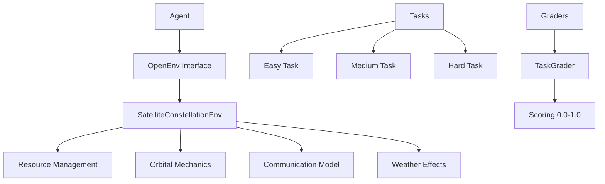

# Satellite Constellation Management Environment

[](https://pypi.org/project/satellite-env/)
[](https://www.python.org/downloads/)
[](https://opensource.org/licenses/MIT)
[](https://openenv.ai)

!!! quote "Real-World RL Environment"
    This OpenEnv environment simulates managing a satellite constellation with limited resources to maximize mission value through reinforcement learning.

## 🌟 Overview

Satellites have limited:

- **🔋 Battery power** (0-100%)
- **💾 Storage capacity** (0-100% used)
- **📡 Communication windows** (availability to ground stations)

**Tasks include:**
- 🌍 **Capture Earth images** (consumes battery, fills storage)
- 📡 **Downlink data** to ground stations (requires communication window, consumes battery, frees storage)
- 🔧 **Perform maintenance maneuvers** (recharges battery)

**The environment is dynamic with:**
- Orbital mechanics (satellite positions change over time)
- Weather conditions (affects imaging quality)
- Resource depletion over time
- Ground station visibility windows

## 🚀 Quick Start

=== "Installation"

    ```bash
    pip install satellite-env
    ```

=== "Basic Usage"

    ```python
    from satellite_env import SatelliteConstellationEnv, Action

    # Initialize environment
    env = SatelliteConstellationEnv(num_satellites=3)

    # Reset for new episode
    observation = env.reset()

    # Take actions
    action = Action(satellite_actions={0: "capture", 1: "maintain", 2: "idle"})
    observation, reward, done, info = env.step(action)

    print(f"Reward: {reward.value}")
    ```

=== "Run Tasks"

    ```python
    from satellite_env import EasyTask, TaskGrader

    # Set up task
    task = EasyTask()
    env = SatelliteConstellationEnv()
    task.setup_environment(env)
    grader = TaskGrader(task)

    # Run episode and get score
    # ... run your agent ...
    score = grader.grade_episode(env, actions, final_state)
    print(f"Task Score: {score:.3f}")
    ```

## 📋 Key Features

- ✅ **OpenEnv Compliant**: Full OpenEnv spec with typed Pydantic models
- ✅ **Real-World Task**: Satellite operations management (human-performed task)
- ✅ **Progressive Difficulty**: 3 tasks from easy to hard (0.0-1.0 scores)
- ✅ **Meaningful Rewards**: Partial progress signals throughout episodes
- ✅ **Extensible Design**: Easy to add new satellites, tasks, and capabilities
- ✅ **Production Ready**: Docker containerization and HF Spaces deployment

## 🎯 Tasks

| Task | Difficulty | Satellites | Max Steps | Target Score | Description |
|------|------------|------------|-----------|--------------|-------------|
| **Easy** | ⭐ | 3 | 50 | 0.7 | Basic imaging with resource management |
| **Medium** | ⭐⭐ | 5 | 100 | 0.5 | Data management and coordination |
| **Hard** | ⭐⭐⭐ | 8 | 200 | 0.3 | Full constellation optimization |

## 📊 Performance Baselines

Run the baseline inference script to get reproducible scores:

```bash
export OPENAI_API_KEY="your-api-key-here"
python inference.py
```

**Expected baseline scores (GPT-4):**
- Easy: ~0.7
- Medium: ~0.5
- Hard: ~0.3

## 🏗️ Architecture



## 📚 Documentation Sections

<div class="grid cards" markdown>

- :material-rocket-launch:{ .lg .middle } **Getting Started**

    ---

    Installation, quick start guide, and basic usage examples

    [:octicons-arrow-right-24: Getting Started](getting-started/installation.md)

- :material-school:{ .lg .middle } **User Guide**

    ---

    Detailed environment overview, action/observation spaces, and task descriptions

    [:octicons-arrow-right-24: User Guide](user-guide/overview.md)

- :material-code-json:{ .lg .middle } **API Reference**

    ---

    Complete API documentation with examples and data models

    [:octicons-arrow-right-24: API Reference](api-reference/core-classes.md)

- :material-wrench:{ .lg .middle } **Development**

    ---

    Setup for contributors, extending the environment, and testing

    [:octicons-arrow-right-24: Development](development/setup.md)

</div>

## 🤝 Contributing

We welcome contributions! This environment is designed for the OpenEnv Hackathon and can be extended in many ways:

- Add more realistic orbital mechanics
- Implement real weather data integration
- Create new task types and complexity levels
- Improve reward functions and evaluation metrics
- Add visualization and monitoring tools

See our [Contributing Guide](development/contributing.md) for details.

## 📄 License

This project is licensed under the MIT License - see the [LICENSE](https://github.com/your-username/satellite-constellation-env/blob/main/LICENSE) file for details.

## 🙏 Acknowledgments

- Built for the OpenEnv Hackathon
- Inspired by real satellite operations at space agencies
- Uses OpenEnv framework for standardized RL environments
- Material theme by MkDocs

---

**Ready to launch your satellite RL agent?** 🚀

[Get Started :material-rocket-launch:](getting-started/installation.md){ .md-button .md-button--primary }