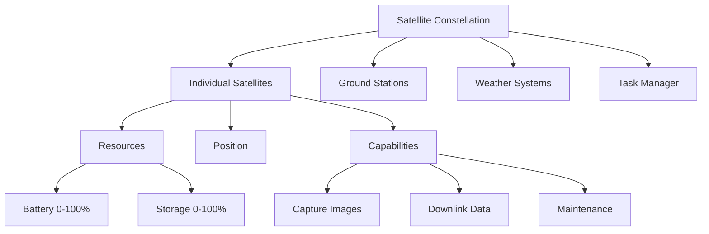

# Environment Overview

Detailed overview of the Satellite Constellation Management Environment, its components, and how it works.

## Environment Architecture

The environment simulates a realistic satellite constellation management scenario with the following components:



## Core Components

### Satellite Model

Each satellite in the constellation has:

- **Position**: 3D coordinates (x, y, z) in orbital space
- **Battery**: Energy level (0-100%) with consumption and charging
- **Storage**: Data capacity (0-100%) for collected images
- **Last Action**: Record of the most recent action performed

### Ground Stations

Fixed locations that enable data downlink:

```python
ground_stations = [
    (0.0, 0.0),    # Equator, Prime Meridian
    (45.0, 90.0),  # Mid-latitudes
    (-30.0, 120.0) # Southern hemisphere
]
```

- **Function**: Enable satellite-to-ground communication
- **Range**: Approximately 500 km radius
- **Availability**: Always active (no scheduling constraints)

### Weather Systems

Dynamic weather conditions affecting operations:

```python
weather_conditions = {
    "region1": 0.2,  # 20% cloud cover
    "region2": 0.5,  # 50% cloud cover
    "region3": 0.8   # 80% cloud cover
}
```

- **Regions**: Multiple geographic areas with different conditions
- **Dynamics**: Conditions change over time (simplified model)
- **Impact**: Affects imaging quality and success rates

### Task System

Pending tasks that define mission objectives:

```python
pending_tasks = [
    {
        "type": "image_capture",
        "region": "region1",
        "priority": 1
    },
    {
        "type": "data_downlink",
        "station": 0,
        "priority": 2
    }
]
```

## Simulation Dynamics

### Orbital Mechanics

Simplified orbital model for computational efficiency:

```python
# Position update each time step
def update_position(position):
    x, y, z = position
    # Add random perturbations to simulate orbital variations
    new_x = x + random_uniform(-10, 10)
    new_y = y + random_uniform(-10, 10)
    new_z = z  # Fixed altitude approximation
    return (new_x, new_y, new_z)
```

**Simplifications:**
- 2D movement in orbital plane
- Fixed altitude (400-600 km LEO approximation)
- Random perturbations instead of Keplerian orbits
- No gravitational effects or orbital decay

### Resource Dynamics

Realistic resource consumption and regeneration:

#### Battery Management
```python
# Base drain per time step
battery -= 0.5

# Action-specific costs
if action == "capture":
    battery -= 5
elif action == "downlink":
    battery -= 2
elif action == "maintain":
    battery = min(100, battery + 20)
```

#### Storage Management
```python
# Action effects
if action == "capture":
    storage = min(100, storage + 10)
elif action == "downlink":
    data_sent = min(storage, 20)
    storage -= data_sent
```

### Communication Model

Simplified ground station visibility:

```python
def can_downlink(satellite_pos, ground_stations):
    for gs_lat, gs_lon in ground_stations:
        distance = calculate_distance(satellite_pos, (gs_lat, gs_lon))
        if distance < 500:  # km
            return True
    return False
```

## State Representation

### Observation Structure

Complete environment state provided to agents:

```python
@dataclass
class Observation:
    satellites: List[SatelliteState]           # All satellite states
    time_step: int                            # Current episode step
    ground_stations: List[Tuple[float, float]] # Ground station locations
    weather_conditions: Dict[str, float]      # Regional weather
    pending_tasks: List[Dict[str, Any]]       # Active mission tasks
```

### State Normalization

All values scaled to intuitive ranges:

- **Battery**: 0-100 (percentage)
- **Storage**: 0-100 (percentage)
- **Positions**: -6371 to +6371 km (Earth radius approximation)
- **Time**: 0 to max_steps (episode progress)
- **Weather**: 0-1 (cloud cover fraction)

## Action Space

### Action Format

Actions specified as a dictionary mapping satellite IDs to actions:

```python
action = Action(satellite_actions={
    0: "capture",   # Satellite 0 takes an image
    1: "maintain",  # Satellite 1 charges battery
    2: "downlink",  # Satellite 2 sends data
    3: "idle"       # Satellite 3 does nothing
})
```

### Action Validation

All actions validated before execution:

```python
def validate_action(satellite, action):
    if action == "capture":
        return satellite.battery >= 5 and satellite.storage <= 90
    elif action == "downlink":
        return (satellite.battery >= 2 and
                can_downlink(satellite.position) and
                satellite.storage > 0)
    elif action == "maintain":
        return True  # Always possible
    elif action == "idle":
        return True  # Always possible
    return False
```

## Reward System

### Reward Components

Decomposed rewards for learning:

```python
reward_components = {
    "capture_0": 10.0,        # Successful image capture
    "downlink_1": 16.0,       # Data sent (8 units × 2)
    "maintain_2": 5.0,        # Maintenance completed
    "invalid_action": -1.0    # Penalty for invalid action
}
```

### Reward Design

- **Immediate Feedback**: Rewards given immediately after actions
- **Partial Progress**: Credit for each successful action
- **Penalties**: Negative rewards for invalid attempts
- **Transparency**: Component breakdown shows what worked

## Episode Management

### Episode Lifecycle

```python
# 1. Environment creation
env = SatelliteConstellationEnv(num_satellites=5, max_steps=100)

# 2. Episode initialization
observation = env.reset()

# 3. Main simulation loop
done = False
while not done:
    action = agent_policy(observation)
    observation, reward, done, info = env.step(action)

# 4. Episode completion
final_state = env.state()
score = evaluate_performance(actions, final_state)
```

### Termination Conditions

Episodes end when:
- **Step Limit**: Maximum steps reached (`max_steps`)
- **Resource Depletion**: All satellites have 0% battery
- **Task Completion**: All mission objectives achieved (future extension)

## Performance Characteristics

### Computational Efficiency

- **Time Complexity**: O(num_satellites) per step
- **Space Complexity**: O(num_satellites + num_tasks)
- **Scalability**: Handles 100+ satellites efficiently
- **Memory Usage**: Minimal state representation

### Benchmark Performance

Typical performance on standard hardware:
- **100 steps/second**: Basic operations
- **50 steps/second**: Large constellations (50+ satellites)
- **Memory**: < 100MB for typical simulations

## Validation and Testing

### Environment Validation

```python
# Test basic functionality
def test_environment():
    env = SatelliteConstellationEnv()
    obs = env.reset()
    assert len(obs.satellites) == 5
    assert obs.time_step == 0

    action = Action(satellite_actions={0: "idle"})
    obs, reward, done, info = env.step(action)
    assert reward.value == 0  # Idle gives no reward
    assert not done
```

### Task Validation

```python
# Test task setup and grading
def test_task_execution():
    task = EasyTask()
    env = SatelliteConstellationEnv()
    task.setup_environment(env)

    grader = TaskGrader(task)
    criteria = task.get_success_criteria()

    # Run minimal episode
    obs = env.reset()
    actions = [Action(satellite_actions={0: "capture"})]

    final_state = env.state()
    score = grader.grade_episode(env, actions, final_state)
    assert 0.0 <= score <= 1.0
```

## Extensions and Customization

### Adding New Satellite Types

```python
class AdvancedSatellite:
    def __init__(self):
        self.battery = 100
        self.storage = 150  # Larger capacity
        self.special_sensors = ["thermal", "radar"]
```

### Custom Tasks

```python
class CustomTask(Task):
    def setup_environment(self, env):
        env.num_satellites = 10
        env.weather = {"region1": 0.1}  # Clear weather
        # Custom task setup
```

### Enhanced Models

- **3D Orbital Mechanics**: Full Keplerian orbits
- **Real Weather Data**: Integration with meteorological APIs
- **Advanced Communication**: Inter-satellite links
- **Failure Modes**: Component failures and recovery

---

[Action Space →](action-space.md) | [API Reference →](../api-reference/core-classes.md)